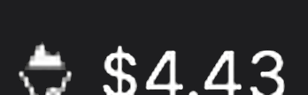
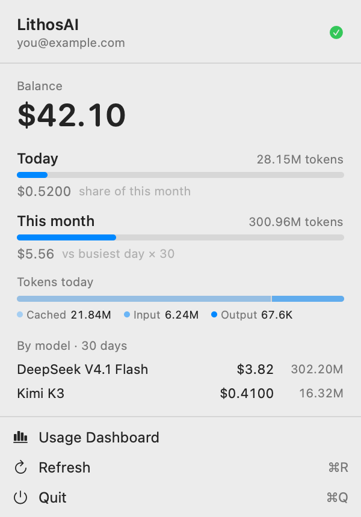

# LithosAI Bar

A menu bar app for LithosAI spend: the provider mark plus your remaining balance
at a glance, with today's usage, a token breakdown, and a per-model
breakdown in the dropdown. It is a menu bar extra only — no Dock icon and no
window.





The screenshots use sample values; the account line is a placeholder.

## Why it reads browser cookies

LithosAI has no public usage or billing API keyed by the inference token. Spend
lives behind the signed-in console session at `console.lithosai.cloud`, so this
app reads that browser session the same way CodexBar reads other providers'
sessions:

1. Copies the Chromium cookie database (Chrome, Brave, Edge, Chromium, Vivaldi).
2. Derives the AES key from the browser's Keychain entry (`* Safe Storage`).
3. Decrypts the session cookie (AES-128-CBC, fixed IV, 32-byte host-hash prefix).
4. Calls the console API with the cookie plus its CSRF header.

Only two cookies matter: `__Host-console_session` and `__Host-console_csrf`.

## Requirements

**Full Disk Access.** macOS blocks one app from reading another app's data, and
a browser's cookie store is exactly that. Grant it once:

1. System Settings → Privacy & Security → Full Disk Access
2. Click `+`, choose **LithosAI Bar** from Applications, and enable it
3. Relaunch the app (the error popup has a Relaunch button)

The app is signed with a stable Developer ID (`23RV7FYH36`), so the grant
survives rebuilds. Ad-hoc signing would not — the permission is bound to the
binary hash.

You must be logged in to `console.lithosai.cloud` in one of the browsers for
usage to be readable. Brave is tried first.

## Build

```sh
./build-app.sh          # builds, signs, installs to /Applications
```

The bundle is assembled in `build/` and installed with `ditto` so the signature
survives the copy.

Headless data check, useful when the UI shows nothing:

```sh
swift build
.build/debug/LithosAIBar --verify
```

This prints the resolved account, balance, today/month spend, and per-model
totals without launching the UI.

## Layout

| File | Role |
|---|---|
| `LithosAIBarApp.swift` | App entry, menu bar item, timer |
| `PopoverView.swift` | Dropdown UI and its reusable pieces |
| `UsageStore.swift` | Refresh loop and display state |
| `LithosAIClient.swift` | Console API client and aggregation |
| `BrowserCookies.swift` | Cookie store read and decryption |
| `Log.swift` | Error log at `~/Library/Logs/lithosai-bar.log` |
| `VerifyCLI.swift` | `--verify` diagnostics |
| `PopoverRender.swift` | `--render-popover` layout preview |
| `Resources/` | Menu bar mark (template) and app icon |
| `docs/` | Screenshots used above |

## Command line

The binary carries a few developer switches:

| Flag | Effect |
|---|---|
| `--verify` | print account, balance, and spend without the UI |
| `--render-popover <path>` | render the dropdown to a PNG |
| `--sample` | with the above, force sample data instead of live values |
| `--install-login-item` | register the app to start at login |

Run them from the installed bundle:

```sh
"/Applications/LithosAI Bar.app/Contents/MacOS/LithosAIBar" --verify
```

## Notes on the console API

Discovered by reading the console's JavaScript bundle; none of it is documented.

| Endpoint | Returns |
|---|---|
| `GET /api/me` | Account and active organization |
| `GET /api/billing` | `balanceNanos`, card state |
| `GET /api/billing/spend?start=…&end=…` | Daily rows per model with token counts |

Money is integer **nanocents**: the console treats values below `1e7` as
"less than $0.01", so `1e7` nanocents = 1 cent and `1 USD = 1e9`.

`start` and `end` are both required (`YYYY-MM-DD`); the endpoint 400s on any
other range spelling. Rows are only returned for days that had activity.